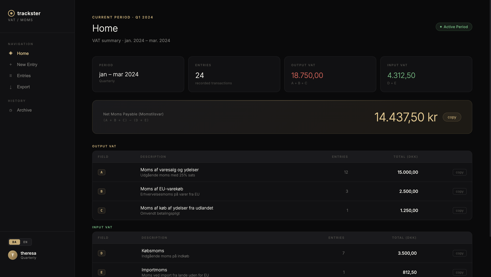

# Trackster

A VAT and expense tracker for managing accounting periods, expenses, and exports in one place.

I built Trackster to simplify the process of keeping track of business expenses and preparing accounting data without relying on scattered spreadsheets, receipts, and manual calculations.

## What it does

Trackster provides a structured workflow for:

- Managing accounting periods
- Recording and organizing expenses
- Tracking VAT
- Keeping financial entries in one place
- Reviewing period totals
- Exporting receipts as merged PDFs by VAT category

The focus is deliberately practical: make recurring administrative work easier to understand, maintain, and hand over for accounting.

## Product approach

Rather than treating expenses as isolated entries, Trackster organizes them around accounting periods and the workflow they belong to.

The interface is designed to keep the information dense enough to be useful while making totals, individual entries, and actions easy to scan.

I designed and developed the product end-to-end, from the data structure and application logic to the interface and implementation.

## Development

The tracked application source is a React frontend in `trackster.jsx`. It stores data through the host-provided `window.storage` API when available, with browser `localStorage` as a fallback.

### Built with

Verified from the tracked application source:

- React with hooks
- JavaScript / JSX
- CSS with custom properties
- Browser Web Storage (`localStorage`)
- pdf-lib 1.17.1 for merging receipts and exporting PDFs

### Source availability

This repository contains the tracked React frontend source in `trackster.jsx` for review. The application setup and build configuration are not included, so this checkout is not configured to run locally.

## Status

Trackster is an independent software project and remains under active development.

## More work

See more of my design and software work at [halfodd.com](https://www.halfodd.com/).

## License

Proprietary - all rights reserved. See [LICENSE](LICENSE).
